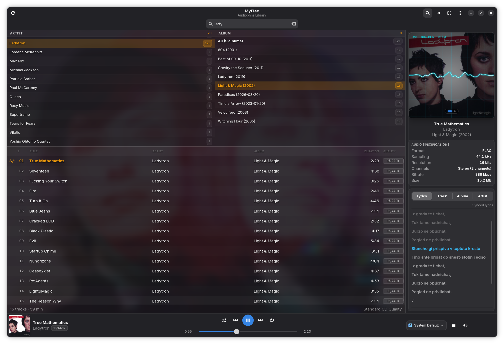
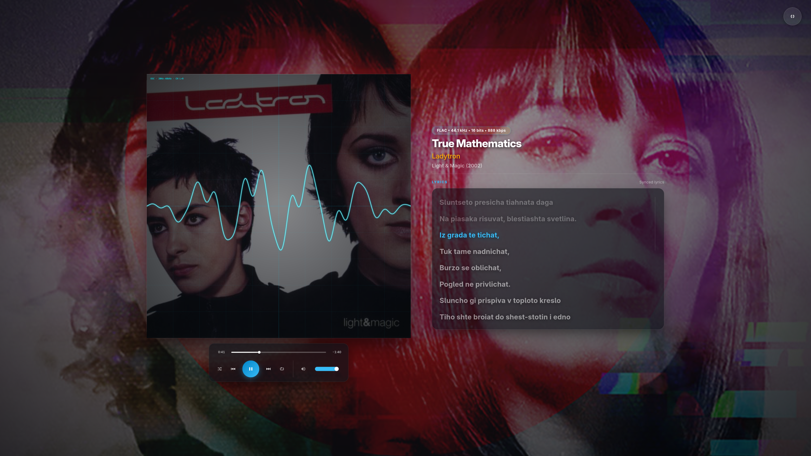

# MyFlac

**A clean, bit-perfect Hi-Res music player and library browser for the Linux desktop.**

MyFlac is designed for those who want to listen to their music collection in pristine audiophile quality, with zero unnecessary bloat, a modern GNOME/Libadwaita interface, and rich contextual information about every song, album, and artist.



## Why MyFlac

No audio player on Linux quite matched what I was looking for: I wanted true bit-perfect hardware output without fighting system sound servers, automatic synchronized lyrics that scroll smoothly like in Roon or Apple Music, and a clean, native interface that looks at home on GNOME. Just like what drove me to build [MyTag](https://maestebanc.github.io/MyTag/), I created MyFlac to fit my exact tastes and needs as a music lover.

### The MyFlac & MyTag Suite

MyFlac and [MyTag](https://maestebanc.github.io/MyTag/) are designed as companion applications:
- **[MyTag](https://maestebanc.github.io/MyTag/)**: Edit tags, batch-organize tracks, fetch high-resolution covers, and verify file integrity.
- **MyFlac**: Play your music in studio-grade fidelity, with hardware ALSA bit-perfect output, synchronized lyrics, and rich encyclopedia insights.

---

## Key Features

- **Pure Bit-Perfect Playback**: Direct hardware access to your DAC via exclusive ALSA (`hw:CARD=...,DEV=...`) with D-Bus device reservation (`org.freedesktop.ReserveDevice1`). No forced resampling, no digital dithering, and volume fixed at 0 dB.
- **Roon-Style Synchronized Lyrics**: Real-time line-by-line lyrics fetched via LRCLIB. Active lines are highlighted and kept centered with smooth scrolling; click any line to seek instantly to that position.
- **Ambient Backdrop & Artist Wallpapers**: The library background softly blurs and tints the artist's photography, preserving crisp readability while creating a modern, warm atmosphere.
- **Wikipedia & Discogs Insights**: Built-in tabs in the inspector panel displaying the story of the track, album, and artist — including release year, label, country, formats, musicians, producers, and liner notes, auto-translated to Spanish or Catalan.
- **Three Viewing Modes**:
  - **Main Window**: Dual-column browser (Artists and Albums), fast search, and metadata inspector.
  - **Mini-Player (500×500 px)**: Compact floating square with clean album art or real-time oscilloscope, with auto-hiding HUD controls.
  - **Fullscreen Super-Player**: Immersive listening experience with high-resolution artist photography, translucent lyrics card, and phosphor oscilloscope.



- **System Tray Integration**: Standard StatusNotifierItem / AppIndicator. Left-click opens a sleek popup with cover art and progress bar; right-click opens a full D-Bus menu, and scrolling the mouse wheel adjusts the volume.
- **Ultra HD Cover Art**: If an embedded cover is low resolution (e.g. 500 px), MyFlac searches iTunes/Deezer for a matching high-resolution version (up to 2000 px) using strict pixel-correlation checks to ensure exact image identity. Press `Ctrl+P` to zoom into full-screen album art.
- **Multi-Format Audio Engine**: Seamless gapless playback for FLAC, MP3, WAV, AIFF, M4A/AAC, OGG Vorbis, OPUS, and DSD (DSF/DFF).
- **Trilingual Interface**: Full native support for **Spanish, Catalan, and English**, matching your desktop locale.

<p align="center">
  
</p>

---

## Installation

Grab the pre-built packages from the [GitHub Releases page](https://github.com/maestebanc/MyFlac/releases).

### Flatpak (any Linux distribution)

```bash
flatpak install myflac-0.1.1.flatpak
```

### Fedora / RHEL (RPM)

```bash
sudo dnf install ./myflac-0.1.1-1.noarch.rpm
```

### Debian / Ubuntu (24.04 LTS+, Debian 13+)

```bash
sudo apt install ./myflac_0.1.1-1_all.deb
```

### Arch Linux

Install the pre-built package with `pacman`:

```bash
sudo pacman -U myflac-0.1.1-1-any.pkg.tar.zst
```

Or build from source using the included `PKGBUILD`:

```bash
cd packaging/arch
makepkg -si
```

---

## Running from Source

MyFlac requires Python 3.11+, GTK4, Libadwaita, GStreamer, and PyGObject:

### System Dependencies

**Fedora**:
```bash
sudo dnf install python3 python3-gobject gtk4 libadwaita gstreamer1 gstreamer1-plugins-base gstreamer1-plugins-good
```

**Debian / Ubuntu**:
```bash
sudo apt install python3 python3-gi gir1.2-gtk-4.0 gir1.2-adw-1 gstreamer1.0-plugins-base gstreamer1.0-plugins-good
```

**Arch Linux**:
```bash
sudo pacman -S python python-gobject gtk4 libadwaita gst-plugins-base gst-plugins-good
```

### Clone and Run

```bash
git clone https://github.com/maestebanc/MyFlac.git
cd MyFlac
./run.sh
```

---

## Keyboard Shortcuts

| Shortcut | Action |
| :--- | :--- |
| <kbd>Space</kbd> | Play / Pause |
| <kbd>Ctrl</kbd> + <kbd>→</kbd> / <kbd>←</kbd> | Next / Previous track |
| <kbd>Shift</kbd> + <kbd>→</kbd> / <kbd>←</kbd> | Seek ±10 seconds |
| <kbd>Ctrl</kbd> + <kbd>↑</kbd> / <kbd>↓</kbd> | Volume up / down |
| <kbd>Ctrl</kbd> + <kbd>1</kbd> | Main Window view |
| <kbd>Ctrl</kbd> + <kbd>2</kbd> | Mini-Player view (500×500) |
| <kbd>Ctrl</kbd> + <kbd>3</kbd> / <kbd>F11</kbd> | Fullscreen Super-Player |
| <kbd>Ctrl</kbd> + <kbd>P</kbd> | Full-size Cover Popup |
| <kbd>Ctrl</kbd> + <kbd>I</kbd> | Toggle Cover / Artist Photo mode |
| <kbd>Ctrl</kbd> + <kbd>E</kbd> | Toggle Bit-Perfect Exclusive mode |
| <kbd>Ctrl</kbd> + <kbd>,</kbd> | Open Preferences |
| <kbd>Ctrl</kbd> + <kbd>?</kbd> / <kbd>F1</kbd> | Keyboard Shortcuts cheat-sheet |
| <kbd>Ctrl</kbd> + <kbd>Q</kbd> | Quit MyFlac |

---

## License

MyFlac is open-source software released under the [GNU General Public License v3.0 or later (GPL-3.0-or-later)](LICENSE).
